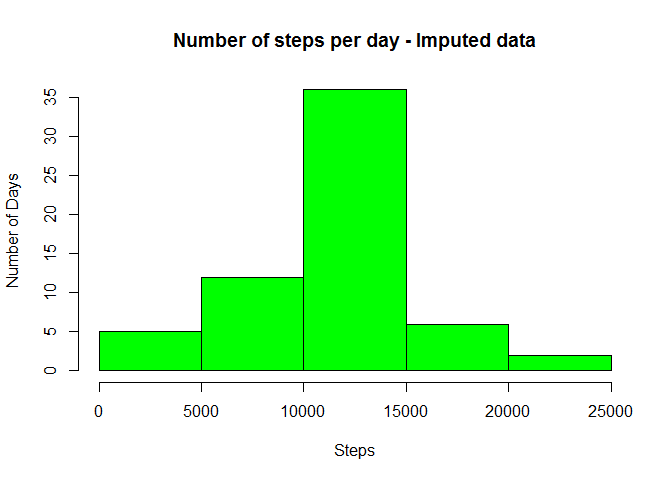

# Reproducible Research: Peer Assessment 1
A complete description of an exploratory analysis on data from a personal activity monitoring device. The data used in this analysis consists of the number of steps registered by a subject during 5 minute intervals throughout the day over the span of several days in the months of October and November 2012. The data is downloaded from the course Assignment page and stored as "activity.zip"

**[Note : Needs lattice package]

## 1. Loading and preprocessing the data


#### Task 1.1 : Read the data
  Read the raw data from the file "activity.csv" using the function read.csv, storing it in the dataframe raw.data and str the data frame to look for the headers and class details.

```r
  raw.data  <- read.csv("activity.csv",header=TRUE)
  str(raw.data)
```

```
## 'data.frame':	17568 obs. of  3 variables:
##  $ steps   : int  NA NA NA NA NA NA NA NA NA NA ...
##  $ date    : Factor w/ 61 levels "2012-10-01","2012-10-02",..: 1 1 1 1 1 1 1 1 1 1 ...
##  $ interval: int  0 5 10 15 20 25 30 35 40 45 ...
```

#### Task 1.2 : Preprocessing
  - The Steps column is of the integer class as desisred for a count of the activity, and the date column is in the factor class. 
  - Have the interval column (denoting the specific interval in a day) to also be in a factor and useful to have a variable as integer holding all the factors in a numeric vector for plotting the daily activity graph.

```r
  daily <- as.numeric(levels(as.factor(raw.data$interval)));
```

## 2. What is mean total number of steps taken per day?

#### Task 2.1 : Histogram of Total number of steps

  - Find total number of steps per day using the function tapply(), ignoring the NA values.

```r
  stepsperday <- tapply(raw.data$steps, raw.data$date, sum, na.rm=TRUE);
```

  - Plot Histogram of total number of steps taken each day

```r
  hist(stepsperday,main="Number of steps per day", col="blue",
       xlab="Steps",ylab="Number of Days")
```

 

#### Task 2.2 : Find and report Mean and Median

  - Find mean and median of the number of steps taken per day

```r
  mean1 <- mean(stepsperday)
  print(mean1);
```

```
## [1] 9354.23
```

```r
  median1 <- median(stepsperday);
  print(median1);
```

```
## [1] 10395
```

## 3. What is the average daily activity pattern?

#### Task 3.1 :  Find total steps per interval averaged over all days

  - Now looking into the daily pattern averaged over all the days, we first compute mean number of steps in each of the time interval in the day.
  - Compute the mean using tapply, now factoring across the daily intervals, and make a line plot.


```r
mean <- tapply(raw.data$steps, (raw.data$interval), mean, na.rm=TRUE);
plot(daily, mean, type='l',
     xlab="Time Interval", ylab="Average Number of Steps",
     main = "Daily Average of Number of Steps across 5 min Intervals"
     ,col='blue');
```

 

#### Task 3.2 : Peak activity in the day

  - The time interval in the day with the maximum number of steps (averaged across all the days) is calculated as
  

```r
  intervalmax <- names(which.max(mean));
  print(intervalmax);
```

```
## [1] "835"
```

  Though it is obvious that the peak activity is at the interval 835 it is computed formally and reported for reproducability.
  
## 4. Imputing missing values

#### Task 4.1 : Missing values
  Thus far in the analysis, we have used "na.rm = TRUE" in every function to ignore the missing values in the dataset. However, the mean and other statistics reported may not reflect the vital stats of the actual activity which was monitored.
  
  - First, we find the total number of missing values in the dataset
  

```r
  nsteps.missing <- is.na(raw.data$steps);
  print(sum(nsteps.missing));
```

```
## [1] 2304
```
#### Task 4.2 : New dataframe with missing values filled in

  - We try to fill the "NA" values with a simple, but reasonable values in an attempt to reduce the bias created due to improper data-collection. 
  - Fill in each missing step observation with the average across all days for that 5min interval.

```r
  nsteps.rawmean <- tapply(raw.data$steps, raw.data$interval, mean, na.rm=TRUE);
  nsteps.imputed <- raw.data$steps
  nsteps.imputed[nsteps.missing] <- as.integer(nsteps.rawmean);
```

#### Task 4.3 : Create a new dataframe 'imputed.data'
  

```r
  imputed.data <- raw.data;
  imputed.data$steps <- nsteps.imputed;
  stepsperday.imputed <- tapply(imputed.data$steps, raw.data$date, sum);
```

#### Task 4.4 : plot the histogram of the imputed data

```r
  hist(stepsperday.imputed,main="Number of steps per day - Imputed data", col="Green",
       xlab="Steps", ylab="Number of Days") #,
```

 

#### Task 4.5 : Calculate a new mean and median
  - calculate the daily mean and median of the number of steps from the imputed data

```r
  mean1.imp <- format(mean(stepsperday.imputed), scientific = FALSE)
  print(mean1.imp);
```

```
## [1] "10749.77"
```

```r
  median1.imp <-  format(median(stepsperday.imputed), scientific = FALSE)
  print(median1.imp);
```

```
## [1] "10641"
```

  - There is a drastic change in the mean number of steps per day 10749.77 from the mean calculated from the raw data ignoring the NA values (9354.2295082)
  - And, a marginal change, but a definite positive bias through the transformation, in the median value 10641 from the earlier 10395


## 5. Are there differences in activity patterns between weekdays and weekends?
  The final task in this assignment is to explore the data across weekdays and weekends to see if there are any difference in the activity patterns.
  
#### Task 5.1

  We create a new factor variable 'days' (to the imputed dataframe imputed.data) using the weekdays() function.


```r
  imputed.data$days <- weekdays(as.Date(imputed.data$date))
  imputed.data$days[imputed.data$days %in% c("Saturday", "Sunday")] <- "weekend"
  imputed.data$days[imputed.data$days != "weekend"] <- "weekday"
```

  Now that we have created the factor variable, we create a data table, grouping the data into the factor-groups and make exploratory plots, a 2-panel lattice plot in this case. 

```r
  imputed.data.table <- with(imputed.data, tapply(steps, list(interval, days), mean))
  imputed.data.table <- as.data.frame(as.table(imputed.data.table))
  names(imputed.data.table) <- c("interval","days","steps_avg")
  imputed.data.table$interval <- as.numeric(as.character(imputed.data.table$interval))
```

#### Task 5.2

  From the table thus created, using the lattice package, we make a 2-panel plot of the mean of number of in weekdays and weekends across the intervals in the day.

```r
  library(lattice)
  xyplot(steps_avg ~ interval | days, data = imputed.data.table, type = 'l',
         layout = c(1,2),xlab = "Time Interval", ylab = "Average Number of Steps", 
         panel = function(y, ...){panel.xyplot(y, ...) 
                                  panel.abline(h = mean(y), lty = 3)
})
```

 

##### Observations :
  1. It is observed from this comparison that the weekdays have a marginally lower mean number of steps, with a higher max just prior to the middle of the time among the observed intervals, which may be interpreted as the early part of the day. 
  2. The rest of the day on weekdays have a flatter trend, while the whole of the day in Weekends show a flat trend with occassional peaks distributed throughout the day, unlike the weekdays showing a marked time slot with maximum walking.

